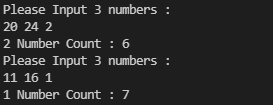

a와 b사이에 k의 개수를 세는 간단한 프로그램이다

`예)`

`입력 : 20 24 2`

`출력 : 6`


프로그램은 loop를 이용해 전체 코드를 무한 루프


## 숫자 입력 받기

데이터를 입력 받기 위해 io::stdin()의 read_line(buf) 함수를 사용한다.

.expect()를 이용해 예외 처리를 해 준다.


```rust
// 수 입력 받음
println!("Please Input 3 numbers : ");
        
// 입력 받은 수 담을 변수
let mut inputString = String::new();

// 입력 받은 수 변수에 담음
// use std::io;
io::stdin().read_line(&mut inputString).expect("Wrong input");
```


## 입력 받은 데이터 변환

입력 받은 데이터는 a b k 형식으로 데이터를 '  '(공백)을 기준으로 분할 할 필요가 있다

다음은 split()과 collect()로 입력 받은 데이터를 Vector에 담는 코드이다.

```rust
// 입력 받은 수 분할
let mut splitString: Vec<&str> = inputString.split(' ').collect();
```


우리가 필요한 데이터는 String 타입이 아닌 Integer타입이기 때문에 형 변환을 해준다.

Vector에 있는 데이터들에 &varvec[Index] 으로 접근하면 된다. 

```rust
// 분할 된 수 나눠 담기
let mut startnum = &splitString[0];
let mut endnum = &splitString[1];
let mut findnum = &splitString[2];

// 나눠 담은 string type의 수 u32로 변환
let startnum: u32 = match startnum.trim().parse(){
    Ok(x) => x,
    Err(_) => continue,
};

let endnum: u32 = match endnum.trim().parse(){
    Ok(x) => x,
    Err(_) => continue,
};

let findnum: u32 = match findnum.trim().parse(){
    Ok(x) => x,
    Err(_) => continue,
};

// 위 코드들은 for in 으로 묶으면 더 깔끔하게 될 것 같다.
```


## 출력 값 구하고 출력하기

필요한 데이터가 모두 준비되었으니 우리가 원하는 값을 반환하는 함수를 만들면 된다.

```rust
fn countNumber(start_num: u32, end_num: u32, find_num: u32) -> u32{
    let mut count_num = 0;
    for i in start_num..(end_num+1){
        let mut current_num = i;
        loop {
            if current_num % 10 == find_num{
                count_num = count_num + 1;
            }
            if current_num / 10 == 0{
                break;
            } else{
                current_num /= 10;
            }
        }
    }
    count_num
}
```

* 이 함수는 1의 자리(current_num % 10)를 우리가 찾는 수와 비교하고 확인한 1의 자리를 없앤다 (current_num /= 10). 

* 자릿수가 1자리만 남으면 반복문을 break 한다(current_num / 10 == 0)


이 함수를 이용하여 원하는 출력 값을 구하고 화면에 출력해 준다.

```rust
// 출력할 값 저장
let count: u32 = countNumber(startnum, endnum, findnum);
println!("{} Number Count : {}", findnum, count);
```


## 프로그램 실행 결과



